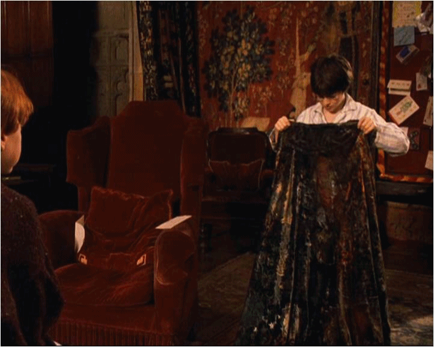
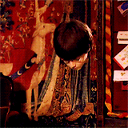

#  InvisibilityCloak.umontp
### IUT Montpellier-Sète – Département Informatique
* **Colaborateurs:** [étudiants du département informatique](https://iut-montpellier-sete.edu.umontpellier.fr/dut-informatique/)

## Présentation
Vous révez de porter la cape d'invisibilité sur l'un de vos serveur Discord ? 

Par-fait ! Ce bot Discord est justement inspiré de la [*Cape d'invisibilité*](https://harrypotter.fandom.com/fr/wiki/Cape_d'invisibilit%C3%A9) d'Harry Potter, il vous permettra de laisser porter votre voix sur l'un des channels d'un de vos serveurs Discord en toute *anonymité*.

[*Cliquez ici pour l'inviter sur votre serveur !*](https://discord.com/oauth2/authorize?client_id=766973211559854091&scope=bot&permissions=0)
## Comment porter la cape sur votre serveur favori
### Première étape : récupérer le nom du channel

Petite astuce pour récupérer le nom d'un channel : écrivez le symbole `#` dans l'un des channels du serveur pour récupérer directement le nom d'un channel.

### Deuxième étape : Faire une requête à la cape

Une fois le nom du channel copié, envoyez en message privé votre commande `!send {nom-du-channel} {votre message anonyme}`  à **InvisibilityCloak.umontp**.

Bien sûr avant d'envoyez la commande assurez-vous que le serveur soit en commun avec le bot, [(s'il ne l'est pas, invitez-le sur le serveur en cliquant ici)](https://discord.com/oauth2/authorize?client_id=766973211559854091&scope=bot&permissions=0).

### Finish !!
Le message anonyme est maintenant disponible sur le channel !

*Vous voilà invisible !*

#### Voici les différentes commandes d'*InvisibilityCloak.umontp* : 
- Commande principale : 
  - `!send {nom-du-channel} {message}` : envoyer un message de manière annonyme sur le channel, en utilisant le nom du channel.
  - `!sendById {ID-du-channel} {message}` : envoyer un message de manière annonyme sur le channel, en utilisant l'ID du channel.
  - `!setPseudo {nom-du-serveur}` : permet d'avoir un nouveau pseudonyme sur le serveur.
  - `!setPseudoById {ID-du-serveur}` : permet d'avoir un nouveau pseudonyme sur le serveur, en utilisant l'ID du serveur.
- Commande secondaire :
  - `!help` : avoir un apperçu des commandes.
  - `!feed-back` : faire un retour sur le bot.
  - `!invite` : pour recevoir le lien pour inviter le bot sur un serveur discord.
  - `!bug` : faire le retour sur un bug rencontré avec le bot.

## Mot des contributeurs
Le projet vous a plu et vous souhaiteriez nous soutenir ? N'hésitez pas à laisser une étoile au projet 🌠 ou encore intégrer la team du DevLab : [Invitation DevLab](https://inscription.devlab.umontp.fr/). 😎
